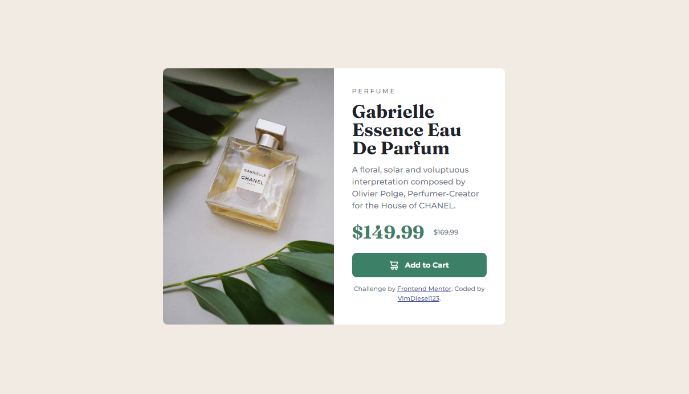

# Frontend Mentor - Product preview card component solution

This is a solution to the [Product preview card component challenge on Frontend Mentor](https://www.frontendmentor.io/challenges/product-preview-card-component-GO7UmttRfa). Frontend Mentor challenges help you improve your coding skills by building realistic projects.

## Table of contents

- [Overview](#overview)
  - [The challenge](#the-challenge)
  - [Screenshot](#screenshot)
  - [Links](#links)
- [My process](#my-process)
  - [Built with](#built-with)
  - [What I learned](#what-i-learned)
  - [Continued development](#continued-development)
  - [Useful resources](#useful-resources)
- [Author](#author)
- [Acknowledgments](#acknowledgments)

## Overview

### The challenge

Users should be able to:

- View the optimal layout depending on their device's screen size
- See hover and focus states for interactive elements

### Screenshot



### Links

- Solution URL: [Github](https://github.com/VimDiesel123/Product-Preview-Card-Component)
- Live Site URL: [Netlify site](https://strong-bienenstitch-ca814f.netlify.app/)

## My process

### Built with

- Semantic HTML5 markup
- CSS custom properties
- Flexbox
- CSS Grid
- Mobile-first workflow
- Help from a youtube video

### What I learned

This the first (kinda) Frontend Mentor project I've ever completed! I am a noob at HTML and CSS so I learned a lot doing this even though it was a simple challenge. I learned about the

```html
<picture> </picture>
```

tag in html! It's was very useful for switching the images depending on screen width. I learned a lot about CSS basics like layout, grid, flex-box, font sizing, hover and focus states etc.

### Continued development

There is a lot I need to learn. In particular, I still find mobile-first and responsive design to be a bit tricky. I think I need to practice it more and get a more firm grasp of layout in CSS before it becomes comfortable for me. Also, I tried to use BEM in this challenge but tbh, I barely understand what it is and what the purpose of it is. I'm going to study that later.

### Useful resources

- [This youtube video by Kevin Powell](https://www.youtube.com/watch?v=B2WL6KkqhLQ) - Kevin Powell's video doing this challenge. Very helpful video I watched to get some ideas and I used when I got stuck. I tried to not just copy what he did though.
  He is a guru and a very Positive Mental Attitude gentlemen. Anything I know about CSS at this point is from either the MDN docs or him.

## Author

- Website - [David Smith](https://github.com/VimDiesel123)
- Frontend Mentor - [@VimDiesel123](https://www.frontendmentor.io/profile/VimDiesel123)

## Acknowledgments

Thanks for the help Kevin Powell!
